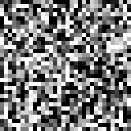
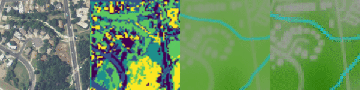

# Diffusion Models as Plug-and-Play Priors
Code for [Diffusion Models as Plug-and-Play Priors](https://arxiv.org/abs/2206.09012) (NeurIPS 2022).

```bibtex
@inproceedings{graikos2022diffusion,
   title={Diffusion Models as Plug-and-Play Priors},
   author={Alexandros Graikos and Nikolay Malkin and Nebojsa Jojic and Dimitris Samaras},
   booktitle={Thirty-Sixth Conference on Neural Information Processing Systems},
   year={2022},
   url={https://arxiv.org/pdf/2206.09012.pdf}
}
```

## MNIST
The code in the `mnist` directory is sufficient to reproduce the MNIST experiments of Section 3.1. The `mnist/train\_diffusion.ipynb` Jupyter notebook trains the MNIST DDPM model. The `mnist/inference.ipynb` notebook can be used to run our inference algorithm with both hand-crafted and learned constraints. The video demonstrates the generation procedure for a symmetric digit of class '3'.



## FFHQ
The code in the `ffhq` directory reproduces the conditional generation procedure described in Section 3.2. The pre-trained DDPM model is taken from https://github.com/yandex-research/ddpm-segmentation. For the attribute classifier, use any pre-trained face-attribute classification model (such as [this](https://github.com/Hawaii0821/FaceAttr-Analysis)). The conditional generation process is presented step-by-step in the `ffhq/infer_with_attributes.ipynb` notebook. The video shows the generation steps for attributes 'blonde' and 'smiling'.


## TSP 
The code in the `tsp` directory is sufficient to reproduce the experiments whose results are shown in Table 2. Running `tsp/train.py` trains a model and `tsp/inference.py` performs inference with the trained model under the default settings. To run the code, it is necessary to download the datasets from https://github.com/chaitjo/learning-tsp, and place them in the `tsp/data` folder. A trained model on 64x64 images of 50-node TSP problems is provided at [this download link](https://diffusion-priors.s3.amazonaws.com/unet50_64_8.pth). The video shows the inference of a TSP solution given the nodes.


# EnviroAtlas Land-Cover Segmentations
The data can be downloaded from [this repository](https://zenodo.org/record/6268150#.YhkcxpPMIws). The code in the `segmentation` directory contains example Jupyter notebooks to train the segmentation diffusion model, compute the per-tile clusterings and perform inference with given clusters and label prior information. A trained UNet on segmentation maps is provided [here](https://diffusion-priors.s3.amazonaws.com/unet_100000.pth).



In all experiments, the U-Net denoiser network is taken from https://github.com/openai/guided-diffusion.
